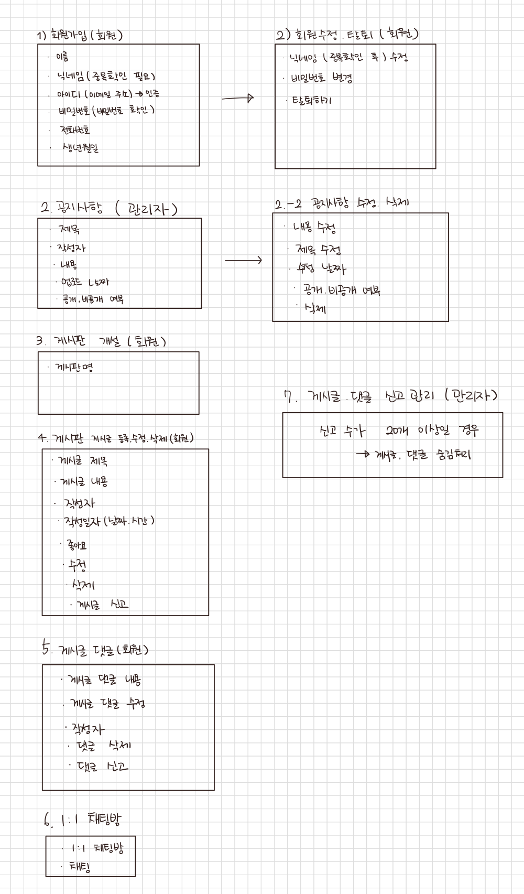
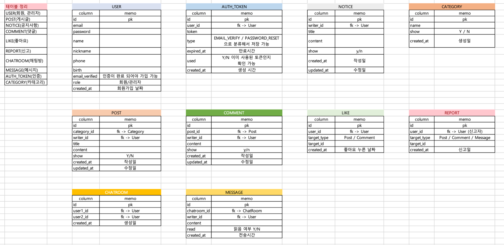
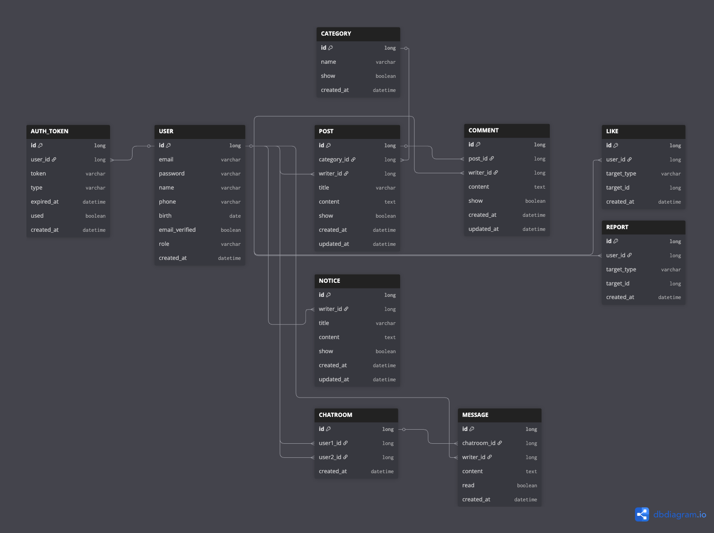

# 취미 플랫폼 프로젝트
 

###  목적: 실시간 소통 취미 플랫폼 (BackEnd Project)

### 핵심기능

- 인증 / 권한
- 1:1 실시간 채팅
- 장르별 게시판(추가 / 삭제)
- 공지사항
- 알림센터
---

### 사이트맵

---
### 테이블 정리

---
### ERD

---
### 모듈 정리

> - common (공통모듈)
> - user(인증 / 회원 모듈)
> - board(게시판 / 공지사항 모듈)
> - interaction(상호작용 모듈)
> - chat(채팅 모듈)
> - api(활성화 모듈)
>
> 
---
### 구현 기능

- 설정
- [ ] Swagger
- [ ] Security
- [ ] MailSender

- 회원 
- [ ] 회원가입
- [ ] 이메일 인증
- [ ] 비밀번호 재설정
- [ ] 회원 탈퇴
- [ ] 로그인

- 게시판 / 공지사항
- [ ] 카테고리 등록(회원/ 관리자)
- [ ] 게시글 작성 (회원)
- [ ] 게시글 수정 (회원)
- [ ] 게시글 삭제 (회원)
- [ ] 게시글 숨김 (관리자 -> 신고 20개 이상일 경우)
- [ ] 댓글 작성 (회원)
- [ ] 댓글 수정 (회원)
- [ ] 댓글 삭제 (회원)
- [ ] 댓글 숨김 (관리자 -> 신고 20개 이상일 경우)
- [ ] 공지사항 작성 (관리자)
- [ ] 공지사항 수정 (관리자)
- [ ] 공지사항 삭제 (관리자)
- [ ] 공지사항 공개여부 (관리자)

- 상호작용
- [ ] 게시판 / 댓글 좋아요 누르기 (회원)
- [ ] 좋아요 취소 (회원)
- [ ] 게시판 / 댓글 신고 하기 (회원)

- 채팅
- [ ] 채팅방 만들기
- [ ] 메세지 보내기
- [ ] 읽음 여부
